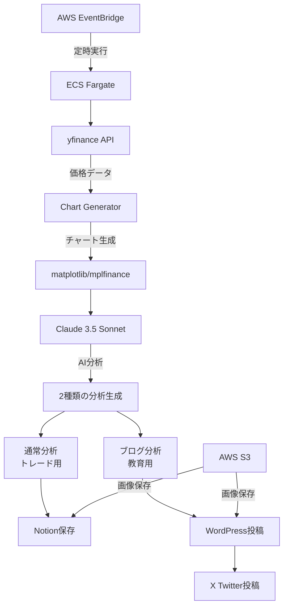

# 🤖 FXチャート自動分析システム

**USD/JPYチャートを自動生成→AI分析→Notion保存→ブログ投稿**を日本時間で定時実行するシステムです。

[](https://opensource.org/licenses/MIT)
[](https://www.python.org/downloads/)
[](https://aws.amazon.com/)

## ✨ 主な特徴

- 🕐 **定時自動実行**: 日本時間 8:00, 15:00, 21:00（平日のみ）
- 📊 **多時間軸分析**: 5分足・1時間足のチャート生成（yfinance + matplotlib）
- 🤖 **AI分析**: Claude 3.5 SonnetによるVolmanスキャルピングメソッド分析
- 📝 **自動記録**: Notionデータベースに結果保存
- 📰 **ブログ自動投稿**: WordPress + X（Twitter）連携（8:00のみ）
- ☁️ **クラウド対応**: AWS ECS Fargate + S3で完全自動化
- 🛡️ **エラー処理**: 包括的なエラーハンドリングと監視

## 🎯 システム概要



### 🔄 処理フロー
1. **チャート生成**: yfinanceでUSD/JPY価格データ取得→matplotlib/mplfinanceでチャート生成
2. **AI分析（2種類）**: 
   - **通常分析**: Volmanメソッドによる6つのセットアップ識別とトレードプラン
   - **ブログ分析**: Volman理論に基づく教育的解説（投資助言なし）
3. **画像保存**: AWS S3に高解像度チャート画像をアップロード
4. **結果記録**: Notionデータベースに通常分析結果を保存
5. **ブログ投稿**: 8:00の分析のみWordPressとXに教育的内容を投稿
6. **通知**: エラー時のSNSアラート

## ⚙️ システム要件

### 最小要件
- **Python**: 3.11+
- **OS**: macOS, Linux, Windows
- **メモリ**: 2GB以上（Playwright用）
- **ストレージ**: 1GB以上

### 必要なアカウント
- [Anthropic Claude](https://console.anthropic.com/) - Claude 3.5 Sonnet API
- [Notion](https://www.notion.so/) - データ保存用
- [AWS](https://aws.amazon.com/) - ECS Fargate・S3用（本番運用時）
- [WordPress](https://wordpress.com/) - ブログ投稿用（オプション）
- [X Developer](https://developer.twitter.com/) - Twitter投稿用（オプション）

### 推奨環境
- **AWS ECS Fargate**: 1 vCPU、2GB メモリ
- **AWS S3**: ap-northeast-1 リージョン
- **Notion**: フルページデータベース
- **WordPress**: REST API有効化

## 🚀 クイックスタート

### 1. 最短セットアップ（30-60分）
```bash
# 1. リポジトリクローン
git clone https://github.com/wataru05160621/analyze_FX_chart.git
cd analyze_FX_chart

# 2. 自動セットアップ
chmod +x setup.sh
./setup.sh

# 3. APIキー設定
cp .env.example .env
# .envを編集してAPIキーを設定

# 4. テスト実行
source venv/bin/activate
python debug_tool.py  # システム診断
python -m src.main    # 1回実行テスト
```

**詳細な手順**: [📖 クイックスタートガイド](docs/quick_start.md)

### 2. AWS Lambda 本番デプロイ
```bash
# 環境変数設定
export OPENAI_API_KEY="your_key"
export NOTION_API_KEY="your_key" 
export NOTION_DATABASE_ID="your_id"

# ワンコマンドデプロイ
chmod +x deploy.sh
./deploy.sh prod sam
```

### 3. 運用開始
**日本時間 8:00, 15:00, 21:00 に自動実行開始！**

## 🔧 カスタマイズ

### チャート設定
```python
# src/config.py
TIMEFRAMES = {
    "5min": "5",
    "15min": "15",    # 15分足追加
    "1hour": "60",
    "4hour": "240"    # 4時間足追加
}
```

### 分析プロンプトのカスタマイズ
```python
# src/config.py
ANALYSIS_PROMPT = """
カスタム分析指示：
1. RSI・MACD指標の分析
2. フィボナッチレベルの確認
3. 今後4時間の予測
"""
```

### 実行スケジュールの変更
```yaml
# template.yaml (AWS Lambda)
events:
  CustomSchedule:
    Type: Schedule
    Properties:
      Schedule: cron(0 10 * * ? *)  # 日本時間19:00
```

## 🤝 コントリビューション

1. Forkしてください
2. フィーチャーブランチを作成: `git checkout -b feature/amazing-feature`
3. コミット: `git commit -m 'Add amazing feature'`
4. プッシュ: `git push origin feature/amazing-feature`
5. Pull Requestを作成

## 📄 ライセンス

MIT License - 詳細は [LICENSE](LICENSE) を参照

## 🙏 謝辞

- [OpenAI](https://openai.com/) - GPT-4 API
- [Notion](https://www.notion.so/) - データベースAPI
- [Playwright](https://playwright.dev/) - ブラウザ自動化
- [AWS](https://aws.amazon.com/) - クラウドインフラ

---

**⭐ このプロジェクトが役立ったら、GitHubでスターをお願いします！**

## 📖 ドキュメント

### 📚 ドキュメント管理について

本プロジェクトのドキュメントは `docs/` ディレクトリで一元管理されています。
- **命名規則**: `XX_document_name.md` 形式（XXは2桁の連番）
- **索引ファイル**: [`docs/00_DOCUMENT_INDEX.md`](docs/00_DOCUMENT_INDEX.md) で全ドキュメントの一覧と概要を確認できます

### 🔍 主要ドキュメント

| 📄 ドキュメント | 📝 説明 |
|---------------|--------|
| [📚 ドキュメント一覧](docs/00_DOCUMENT_INDEX.md) | 全ドキュメントの索引・カテゴリ別整理 |
| [🚀 クイックスタート](docs/quick_start.md) | 30分で本番運用開始 |
| [☁️ AWS設定ガイド](docs/aws_setup.md) | ECS Fargate・S3の詳細設定 |
| [✅ 本番チェックリスト](docs/production_checklist.md) | 運用前の確認事項 |
| [🔧 Notion設定](docs/notion_setup.md) | Notion API・データベース設定 |
| [📰 ブログ投稿設定](doc/blog_setup_guide.md) | WordPress・X自動投稿設定 |
| [⏰ スケジューラー設定](docs/scheduler_setup.md) | 定時実行の設定方法 |
| [🧪 本番テスト](docs/production_test.md) | 本番環境でのテスト手順 |

## 💰 コスト見積もり

**月額 $30-50** （1日3回実行の場合）

| サービス | 月額コスト |
|---------|----------|
| Claude API | $20-30 |
| AWS ECS Fargate | $5-10 |
| AWS S3 | $2-5 |
| AWS その他 | $3-5 |
| **合計** | **$30-50** |

## 🛠️ トラブルシューティング

### よくある問題と解決方法

```bash
# システム診断
python debug_tool.py

# 詳細ログでの実行
python -m src.main --debug

# AWS Lambda ログ確認
aws logs tail /aws/lambda/fx-analyzer-prod --follow
```

**詳細**: [🔧 トラブルシューティングガイド](docs/production_test.md#トラブルシューティング)

## 🔮 今後の拡張予定

- [x] 📰 **ブログ自動投稿**: WordPress・X連携（実装済み）
- [ ] 📱 **モバイル通知**: LINEBot連携
- [ ] 📊 **多通貨対応**: EUR/USD, GBP/USD追加
- [ ] 🤖 **自動売買**: MetaTrader MCP統合による取引実行
- [ ] 📈 **パフォーマンス追跡**: 予測精度の測定
- [ ] 🌐 **Web UI**: 分析結果の可視化ダッシュボード