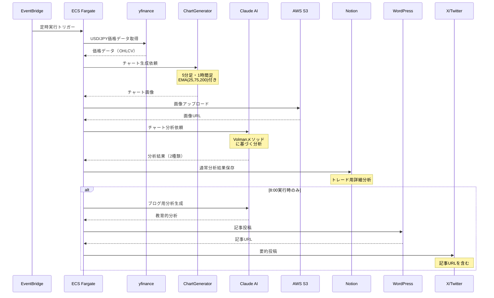
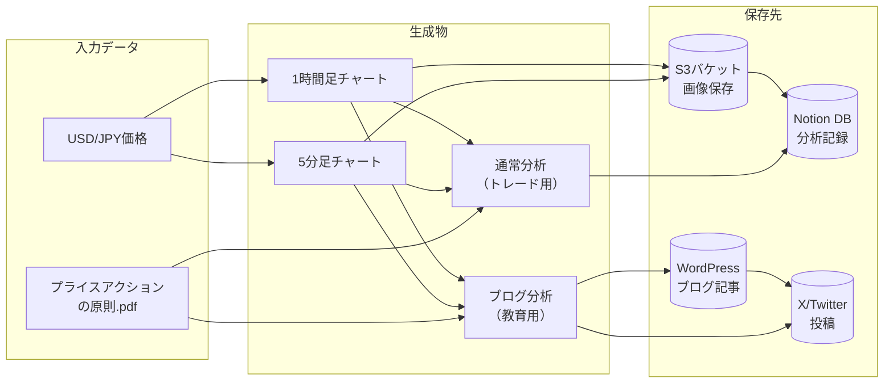
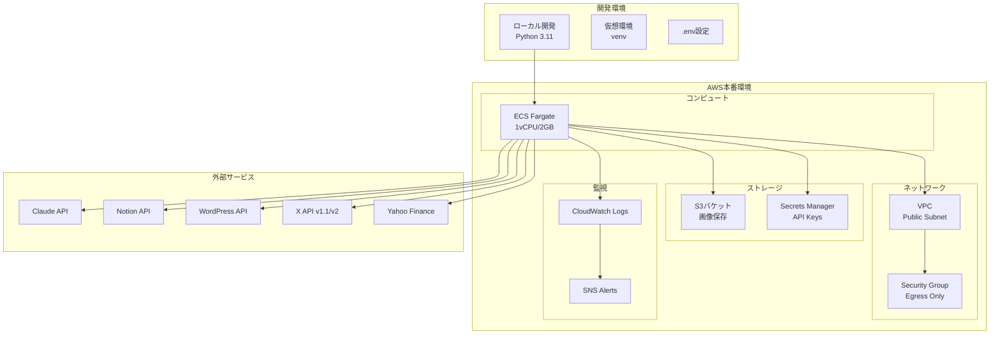
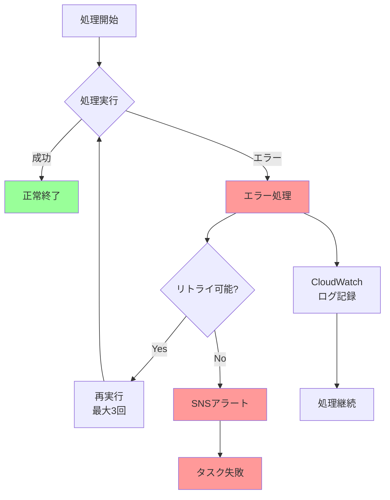
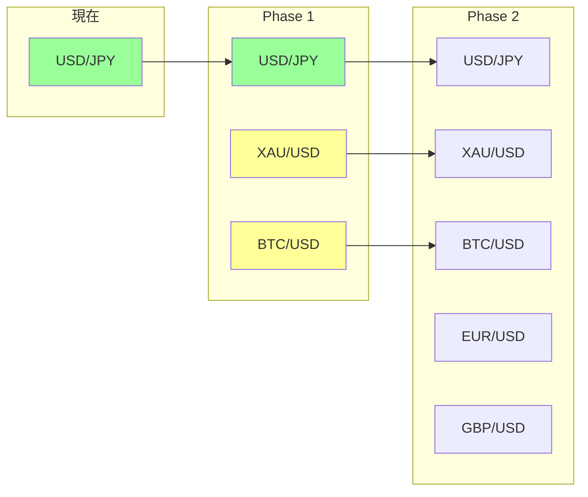

# FX自動分析システム アーキテクチャ

## システム全体構成

```mermaid
graph TB
    subgraph "AWS EventBridge"
        EB1[朝8:00トリガー]
        EB2[昼15:00トリガー]
        EB3[夜21:00トリガー]
    end

    subgraph "AWS ECS Fargate"
        ECS[FX分析タスク]
    end

    subgraph "データ取得"
        YF[yfinance API]
        CG[Chart Generator]
    end

    subgraph "AI分析"
        CA[Claude 3.5 Sonnet]
        BA[ブログ用分析]
        TA[トレード用分析]
    end

    subgraph "データ保存"
        S3[AWS S3<br/>チャート画像]
        NT[Notion<br/>分析結果DB]
    end

    subgraph "ブログ投稿（8:00のみ）"
        WP[WordPress<br/>記事投稿]
        TW[X (Twitter)<br/>要約投稿]
    end

    EB1 --> ECS
    EB2 --> ECS
    EB3 --> ECS
    
    ECS --> YF
    YF --> CG
    CG --> CA
    
    CA --> BA
    CA --> TA
    
    CG --> S3
    TA --> NT
    S3 --> NT
    
    BA --> WP
    WP --> TW
```

## 処理フロー詳細



## データフロー



## 環境構成



## 実行スケジュール

```mermaid
gantt
    title 日次実行スケジュール（JST）
    dateFormat HH:mm
    axisFormat %H:%M
    
    section 平日のみ
    朝の分析（ブログ投稿）  :active, morning, 08:00, 30m
    昼の分析              :afternoon, 15:00, 30m
    夜の分析              :evening, 21:00, 30m
    
    section 処理内容
    チャート生成          :5m
    AI分析               :10m
    Notion保存           :5m
    ブログ投稿(8:00のみ)  :10m
```



## エラーハンドリング



## 通貨ペア拡張計画

