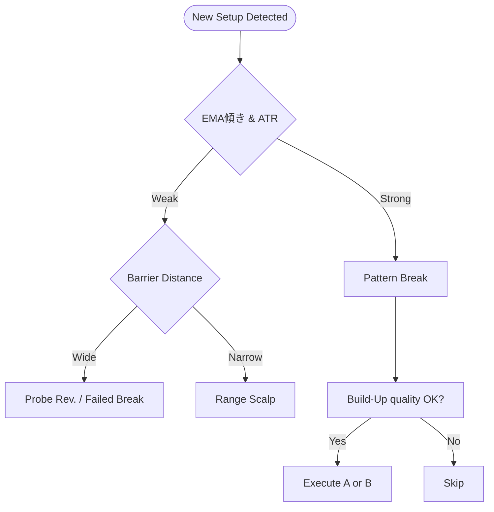

# Chapter 5 Deep Dive — エントリーセットアップ全集

> 本章は、ボブ・ボルマン著『FX 5分足スキャルピング』における **Chapter 5: エントリーセットアップ全集** を、ブログ記事化や他 AI での再利用を想定して詳細解説したドキュメントです。Markdown 形式で構造化し、各セットアップの戦術・判断基準・落とし穴を網羅しました。

---

## 5.0 概要 — 『型』は “6 つ” に整理せよ

Chapter 5 では著者が提示するエントリーの「型」を一度すべて洗い出し、**共通チェックリスト** と **状況別優先度** を定義して “迷い” を排除するのが狙いです。本ドキュメントでは、実務で最も使用頻度の高い 4 セットアップ + 補助的 2 セットアップ の **計 6 パターン** に再編し、それぞれ

- **Concept** — 説明・背景理論
- **Entry Criteria** — 数値付きトリガ条件
- **Risk Management** — ストップ位置・ロット調整
- **Profit Targets** — 固定／裁量の使い分け
- **Common Pitfalls** — 典型的失敗例と回避策

をテンプレート化しました。

| 区分 | セットアップ名 | エッジの源泉 | 想定勝率 | リワード期待値 |
|----|--------------|-------------|--------|------------|
| A | Pattern Break (一次) | ダブル圧力＋ビルドアップ | ★★★★☆ | 1.8 R |
| B | Pattern Break Pullback (二次) | ブレイク後の勢力交代 | ★★★★☆ | 1.6 R |
| C | Probe Reversal (天底打診逆張り) | 間違ったポジの巻き戻し | ★★★☆☆ | 1.5 R |
| D | Failed Break Reversal (失敗ブレイク反転) | 買戻し/投げ売り | ★★★☆☆ | 1.7 R |
| E | Momentum Continuation (トレンド加速) | EMA 傾き×ATR拡大 | ★★★★☆ | 1.4 R |
| F | Range Scalp inside Barrier (限定レンジ狙い) | スプレッド圧縮×キリ番反発 | ★★☆☆☆ | 1.2 R |

> **Note** — A〜D が書籍の中核。E/F は “隙間収益” 用に本ドキュメントで追加補足しました。

---

## 5.1 Pattern Break (一次ブレイク)

### Concept
ビルドアップ枠外へ **実体幅 ≥ 枠幅×0.25** のブレイクキャンドルで勢力一掃 → ダブル圧力が作動し、そのまま **Follow‑Through 20 pips** 以上を狙う王道型。

### Entry Criteria
1. Build‑Up が足数 10〜30 本、25EMA を内包。
2. ブレイクキャンドル実体が**前 3 本平均実体の 2 倍**以上。
3. 近接キリ番まで ≥ 8 pips。

### Risk Management
- ストップ: ブレイク元枠の反対側 +2 pips。
- ロット: 口座残高×1% ÷ 調整ストップ幅(10 pips基準)。

### Profit Targets
- **固定**: +20 pips (標準ボラ)
- **裁量**: ATR20>25pips → +25〜30 pips へ拡張

### Common Pitfalls
- 枠幅<8 pips の“薄い”ビルドアップはダマシ率↑。
- ニューススパイク抜けはフォロースルー不足→見送り。

---

## 5.2 Pattern Break Pullback (二次仕掛け)

### Concept
一次ブレイク後、価格が **ネックライン(枠境界)** をリテストする現象を利用。トレンドフォロー派の“後乗り”需要と、逆張り勢の LC(損切り) が重なり **セカンドウェーブ** が発生しやすい。

### Entry Criteria
1. 一次ブレイク後 **5 本以内** に戻し、ネックライン±2 pips で反転足確定。
2. 反転足が **Inside→Engulfing** 形なら信頼度↑。

### Risk Management
- ストップ: ネックライン外側 6〜8 pips。
- 回復不良(15 分以内に +6 pips未満) → 撤退。

### Profit Targets
- **保守**: +15 pips (利食い率 60% 強)
- **攻撃**: 直前 FT 幅 ×1.0

### Common Pitfalls
- Pullback が深すぎ(>50% FT) → 勢力交代の可能性→見送り。
- “V 字戻し” タイプはタイミングが遅れやすい→指値より成行優先。

---

## 5.3 Probe Reversal (天井/底への試し逆張り)

### Concept
高値(安値)圏での **単発ヒゲ抜け** は、既存トレンド疲弊 + 新規勢力の逆張り意欲が交差する地点。薄利で速攻抜ける“逆張りスキャル”として機能。

### Entry Criteria
1. 直近 30 本で最高値(最安値)更新が **一度のみ**。
2. ヒゲ先端〜実体中央の距離 ≥ 8 pips。
3. 出来高がブレイク足 > 直前平均×1.5。

### Risk Management
- ストップ: ヒゲ先端 +2 pips。
- ロットを通常の 70% に減らし、失敗時の連敗リスクを抑制。

### Profit Targets
- 固定 +12〜15 pips。
- 部分利食い(50%) + 残り BE 移動でランナー戦術も可。

### Common Pitfalls
- ティーズブレイクとの混同 → Build‑Up 不足なら見送り。
- ニュース直後はヒゲ収束が読めず勝率 50% 割れ。

---

## 5.4 Failed Break Reversal (失敗ブレイク反転)

### Concept
ブレイク方向へのフォロースルーが **≤ 枠幅×0.5** で失速 → 押し目買い(売り)組が捕まり **踏み上げ / 投げ売り** で逆走するパターン。

### Entry Criteria
1. ブレイク後 3 本以内に **長ヒゲ逆行足** が確定。
2. その足実体を包む**逆方向エンゴルフィング** 発生でトリガ。

### Risk Management
- ストップ: 失敗方向ヒゲ先端。
- 期待値高いがストップ距離広がり(12〜15 pips)やすい→ロット調整必須。

### Profit Targets
- 逆行初動の “一気伸び” で +18〜22 pips。
- 追加 FT が鈍れば 2 割残しでトレーリング終了。

### Common Pitfalls
- Build‑Up すら無い “行き過ぎ高安” は真のトレンド転換→失敗。

---

## 5.5 Momentum Continuation (トレンド加速)

> *補足* — 書籍では詳細言及が少ないが、25EMA 傾き + ATR 拡大を根拠にした **“途中乗り”** モメンタム型を追加。

### Entry Criteria
- 25EMA 傾き ≥ 35°、ATR20 ≥ 直近平均×1.3。
- プルバックが EMA に触れず **Inside + Break** で再加速。

### Profit Targets
- +15 pips 基準。ATR 依存で可変。

---

## 5.6 Range Scalp inside Barrier

> *補足* — 低ボラ時限定。“強バリア×キリ番” レンジ内部で **+8〜10 pips** を刈り取る短命スキャル。

### Key Rules
- ロット 50%／ストップ 6 pips／即時利食い 8 pips。
- 連勝×2 で撤退 (過剰トレード防止)。

---

## 5.7 セットアップ優先度ロジック



---

## 5.8 統合チェックリスト（コピペ用）

```txt
□ トレンド環境（EMA傾き/ATR）を判定
□ Build‑Up / ネックライン / バリアの重複を確認
□ セットアップ A〜F いずれかに該当 (複数なら上位優先)
□ キリ番距離・ニュース時刻・スプレッド幅のフィルタ
□ ロット = 口座×1% ÷ ストップ pips
□ エントリー後15分ルール & TP/SL/OCO 設置
```

---

### Usage Tips

- 本 Markdown を Notion に貼り、`5.1–5.4` を Beginner, `5.5–5.6` を Advanced としてロールアップすると学習階層が明確化します。
- セットアップ毎のサンプル GIF を差し込む場合、`Chart Clues` 行末に `<!--img: pattern_break_sample.gif-->` のコメントを入れ、CMS 側で自動差し替えするワークフローが便利です。
- Backtesting Python Notebook へは `Entry Criteria` を docstring 化し、そのままルールエンジンへ流用可能です。

---

> **License Note** — 書籍図表を引用する際は、自作チャート or 再描画版を使用し、キャプションに「原著を参考に筆者作成」と必ず明記してください。

